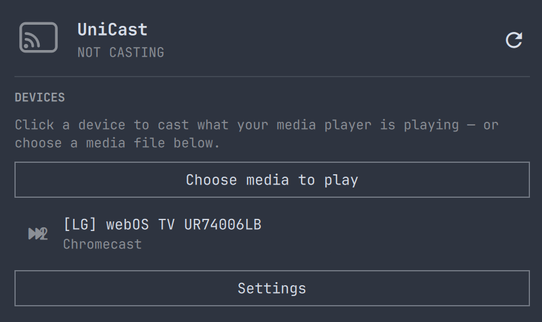
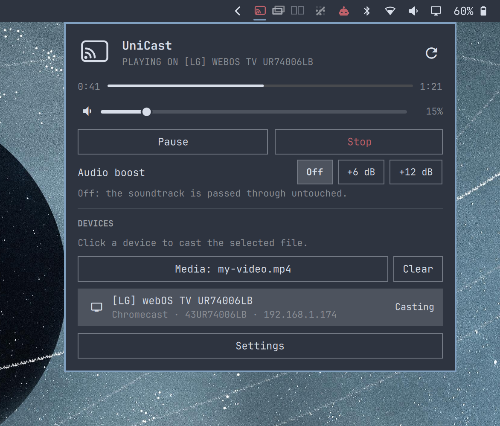

# UniCast

UniCast casts a local video to the TV on the [Omarchy](https://omarchy.org) bar.
Discover any Wi-Fi TV or receiver on your network and cast a local file, or the
file your media player is playing, over **DLNA**, **Google Cast** or
**AirPlay**. The receiver fetches and decodes the media itself, so unlike screen
mirroring the laptop stays free, cool and silent, and high-bitrate or HEVC
content plays smoothly.



While casting, the panel offers pause/resume, seeking, the receiver's **volume**
and mute, an **audio boost** for quiet movie mixes, and **subtitles** on Google
Cast receivers.



The plugin is two parts:

- the bar widget (`BarWidget.qml`, `Panel.qml`), hosted by the Omarchy shell;
- `omarchy-castd`, a small Rust daemon that owns the receiver connection and an
embedded HTTP media server. It runs as a `systemd --user` service and the
widget talks to it over a unix socket, so the panel always shows the real
live state and controls are instant.


## Requirements


| Requirement                                                              | Why                                                                 |
| ------------------------------------------------------------------------ | ------------------------------------------------------------------- |
| Omarchy 4.0.x with the Omarchy shell (tested on 4.0.3, quickshell 0.3.1) | hosts the widget                                                    |
| `ffmpeg` / `ffprobe` (standard on Omarchy)                               | media probing, subtitle conversion, audio boost                     |
| Rust toolchain (≥ 1.85), `cmake` and a C compiler                        | to build `omarchy-castd` once                                       |
| `systemd --user`                                                         | keeps the daemon running; without it the daemon is spawned directly |
| optional: `ufw` + polkit                                                 | if `ufw` is enabled, a per-receiver rule opens the media port       |


Rust crate dependencies are pinned in `Cargo.lock`; all are MIT/Apache-2.0
licensed except `aws-lc-sys` (ISC/Apache-2.0/OpenSSL), pulled in by `rustls`.

## Install

1. Add the widget:
  ```sh
   omarchy plugin add https://github.com/liberuum/unicast --enable
  ```
   The widget lands disabled until you confirm; `--enable` places it in the
   bar's right section (or run `omarchy plugin enable universal-cast`).
2. Build and install the backend. Either click **Build and install the
  backend** in the widget's Settings, or run:
   The script installs missing build/runtime packages through `omarchy pkg add`
   (asking first), builds `omarchy-castd` into `~/.cache/omarchy-cast/target`,
   installs it to `~/.local/bin/omarchy-castd`, and starts it as the
   `omarchy-castd.service` user unit.

Manual equivalent, from a checkout of this repository:

```sh
cargo build --release --locked
install -Dm755 target/release/omarchy-castd ~/.local/bin/omarchy-castd
```

A `PKGBUILD` is included for people who prefer a pacman package
(`makepkg -si` from a tagged release).

## Update

```sh
omarchy plugin update universal-cast     # shows the diff, fast-forwards
~/.config/omarchy/plugins/universal-cast/bin/omarchy-cast-setup   # rebuild the daemon if src/ changed
```


## Remove

```sh
~/.config/omarchy/plugins/universal-cast/bin/omarchy-cast-uninstall   # daemon, unit, firewall rules, cache
omarchy plugin remove universal-cast                                   # the widget
```

The uninstall script keeps your settings in `~/.config/omarchy/cast/`; pass
`--purge` to delete them too. Nothing else is left behind.

## What it touches

Everything is per-user; the plugin never asks for root except the optional
firewall rule below.

- **Files written:** `~/.local/bin/omarchy-castd` (the daemon),
`~/.config/systemd/user/omarchy-castd.service` (created on first use, enabled
for your session), `~/.config/omarchy/cast/` (settings, manual receiver IPs,
firewall ledger), `~/.cache/omarchy-cast/` (build output),
`$XDG_RUNTIME_DIR/universal-cast/` (socket, subtitle cache). It never
edits `shell.json` itself; placement goes through `omarchy plugin enable`.
- **Processes:** `omarchy-castd` (daemon), `ffprobe` per cast, `ffmpeg` while a
stream is remuxed/boosted, `xdg-terminal-exec` when you press the install
button in Settings.
- **Network:** LAN only. SSDP multicast and mDNS for discovery, HTTP/SOAP to
the receiver, TLS to a Cast device on port 8009, and an HTTP media server on
port 60020 bound to your LAN address. Each cast serves one file under an
unguessable token to the target receiver's IP only. No internet access, no
telemetry.
- **Privilege:** if `ufw` is enabled, casting to a new receiver runs
`pkexec ufw allow from <receiver-ip> proto tcp to any port 60020`. Polkit
asks you each time a new receiver is added; the rules are recorded and
removed by the uninstall script (or the daemon's `clear-firewall` verb).
- **Media players:** the "cast what is playing" path reads the current file
from any MPRIS player (VLC, mpv, Celluloid…) over D-Bus.


## Usage

1. Open a video in VLC, mpv or another MPRIS player, or pick a file with
  **Choose media to play**.
2. Click the **UniCast** widget. It scans for receivers.
3. Click a device. The panel shows connecting → buffering → playing, with
  pause, seek, volume, boost and subtitles while it plays.
4. Press **Stop** (or click the hero icon) to end the cast.

A device that does not announce itself can be added by IP in **Settings → Add a
device by IP**.

## Protocols


| Protocol        | Devices                                           | Notes                                                                                                                                                         |
| --------------- | ------------------------------------------------- | ------------------------------------------------------------------------------------------------------------------------------------------------------------- |
| **DLNA / UPnP** | Samsung, LG, Sony, most smart TVs, consoles, Kodi | The TV decodes HEVC/MKV natively. Volume via RenderingControl.                                                                                                |
| **Google Cast** | Chromecast, Android TV, Google TV, many soundbars | Talks CASTV2 directly. Codec-gated: remuxes or transcodes to H.264/MP4 for devices that need it. Volume and subtitles supported.                              |
| **AirPlay**     | Apple TV and other AirPlay 1 receivers            | URL playback over the legacy AirPlay HTTP API. AirPlay 2-only devices require pairing and are routed over DLNA/Cast instead. **Untested**, see Compatibility. |


When one device speaks several protocols it is routed over the most capable one
(DLNA > Cast > AirPlay) and the others are remembered as alternates.

### Codec handling

The backend probes each file with `ffprobe` and, per receiver:

- serves it directly when the device can decode it (an H.264/AAC MP4 stays
byte-range seekable);
- remuxes an already-compatible codec into a streamable container (`-c copy`);
- transcodes with `ffmpeg` only when the codec is unsupported (for example HEVC
to an original Chromecast).

Cast receivers get fragmented MP4; DLNA renderers get MPEG-TS announced with a
nominal Content-Length, because Samsung's player rejects chunked and fragmented
streams. DLNA receivers otherwise decode HEVC/MKV directly, so no transcode is
used.

## Volume and audio boost

Movie mixes are mastered far quieter than TV and streaming content (often 8 to
15 dB below), and the receiver plays the file exactly as mastered. The panel
offers two remedies while casting:

- **Receiver volume**: a slider plus mute, same as the TV remote. Google Cast
receivers support it natively; DLNA renderers need a `RenderingControl`
service (Samsung, LG and most TVs have one). AirPlay URL playback has no
volume API, so the slider is hidden there.
- **Audio boost** (Off / +6 dB / +12 dB): the soundtrack is re-encoded to
stereo AAC with the chosen gain and a look-ahead limiter against clipping; 5.1
sources get a dialogue-forward downmix. Video is copied, not re-encoded, but
seeking then goes through a stream restart instead of byte ranges. The
setting is remembered for later casts, and changing it during a cast restarts
the stream at the current position.


## Subtitles

Google Cast receivers render sidecar text tracks, so while casting to a
Chromecast, Android TV or Google-TV-equipped TV the panel offers a **Subtitles**
picker. Candidates are gathered per file: `.srt`/`.vtt`/`.ass` files next to
the video (`Movie.srt`, `Movie.en.srt`, a `Subs/` folder) and text subtitle
streams inside the container (MKV `subrip`/`ass`, MP4 `mov_text`). Each is
converted to WebVTT with ffmpeg on first use, served next to the media with the
CORS headers Cast requires, and declared as tracks in the load request, so
switching or turning them off is instant. Bitmap subtitles (PGS/VobSub) cannot
be shown this way. The last choice is remembered per language.

DLNA renderers show a file's embedded subtitles through the TV's own menu when
the file is served directly; sidecar files over DLNA are not wired up yet, and
AirPlay URL playback has no subtitle channel.

## Compatibility

Tested on Omarchy 4.0.3 (quickshell 0.3.1, ffmpeg 9.0.1), single laptop, x86_64,
with:

- Chromecast ("Living Room TV"): play, seek, volume, mute, boost, subtitles;
- Samsung UE75TU7125 (2020 TU7000 series) over DLNA: play, seek, volume, mute,
boost via MPEG-TS;
- LG webOS UR74006LB (Chromecast built-in) over Google Cast: play, seek.

Not tested: AirPlay receivers, vertical bars, multi-monitor bars, Omarchy
versions other than 4.0.x. The Quattro plugin contract is still evolving, so
newer shells may need adjustments.

## Security

- The media server binds to the LAN IP only (never `0.0.0.0`) and refuses to
start without an explicit bind address.
- Each cast serves exactly one file under an unguessable path token (compared
in constant time) to an allowlist containing only the receiver's IP.
- Device names, models, IPs and paths (attacker-influenceable over mDNS/SSDP)
flow through argv arrays with validation, never through a shell string, and
are XML-escaped in DLNA metadata. Description fetches do not follow
redirects and are size-capped; a device may only point its control URLs at
itself over http(s).
- Private runtime and config state is owner-only (mode 0700; socket 0600).
- The widget runs unsandboxed inside the Omarchy shell like every plugin;
review the code before enabling it. See [SECURITY.md](SECURITY.md) for how to
report a vulnerability. Marketplace listing is not a security audit.


## Support

Questions and bugs: [https://github.com/liberuum/unicast/issues](https://github.com/liberuum/unicast/issues). Please
include `journalctl --user -u omarchy-castd` output; the daemon logs every
receiver request and ffmpeg command line.

## Development

```sh
tests/run                      # manifest check, cargo fmt/clippy/test, QML parse
cargo build --release
```

The wire contract is newline-delimited JSON over
`$XDG_RUNTIME_DIR/universal-cast/castd.sock`; `bin/omarchy-cast` forwards
the widget's verbs (`status`, `discover`, `connect`, `pause`, `seek`,
`set-volume`, `set-boost`, `set-subtitle`, …) to it. See
[CHANGELOG.md](CHANGELOG.md) for release notes.

## License

MIT, see [LICENSE](LICENSE). Not affiliated with Google, Apple, Samsung, or LG.
Chromecast and Google Cast are trademarks of Google LLC; AirPlay is a trademark
of Apple Inc.