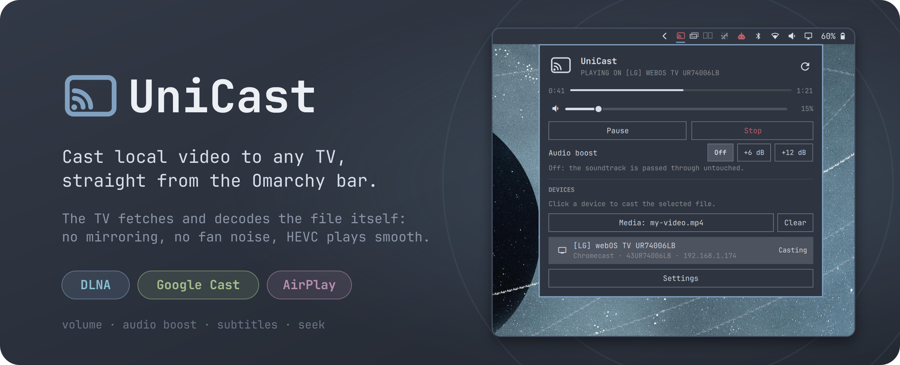
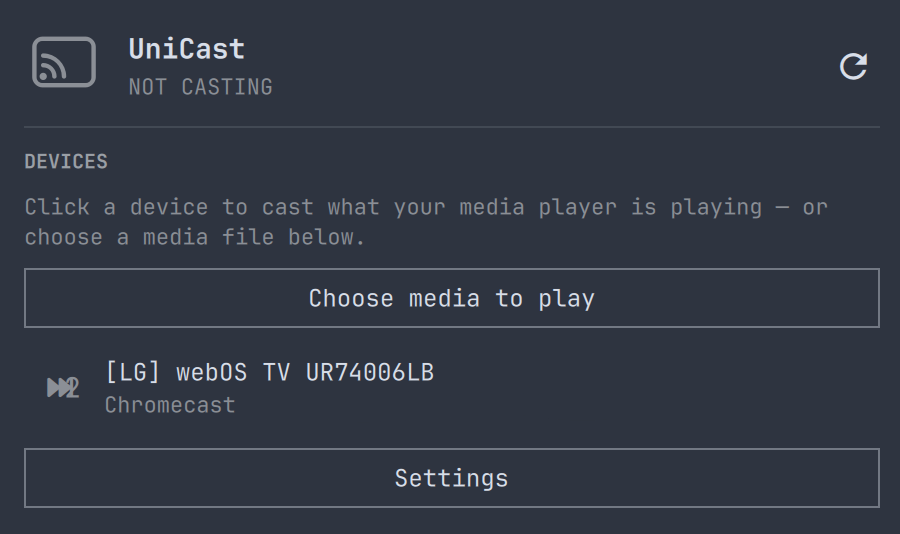
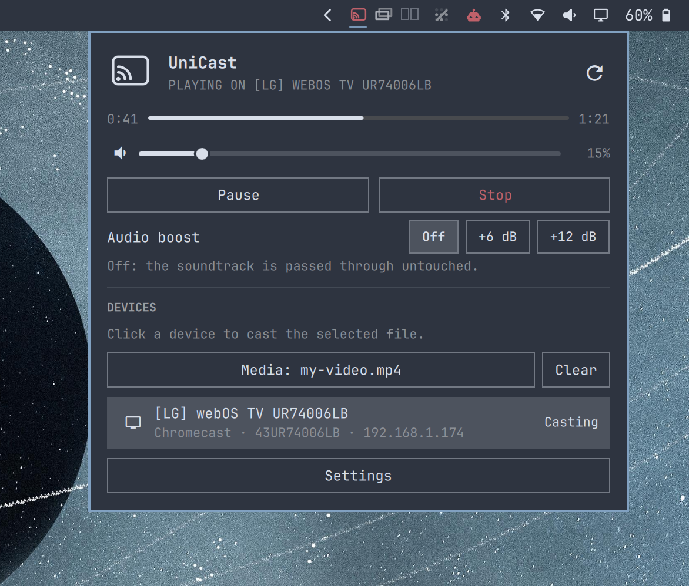
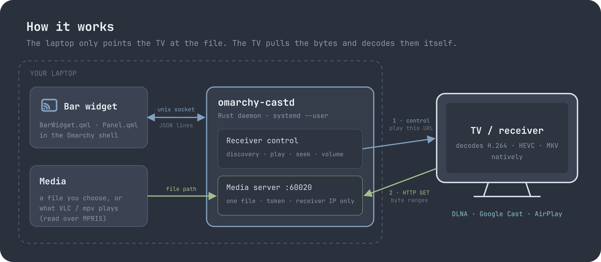

<p align="center">
  
</p>

<p align="center">
  <a href="https://github.com/liberuum/unicast/actions/workflows/ci.yml"></a>
  
  
  <a href="LICENSE"></a>
</p>

<p align="center">
  <a href="#install">Install</a> ·
  <a href="#usage">Usage</a> ·
  <a href="#supported-receivers">Receivers</a> ·
  <a href="#how-it-works">How it works</a> ·
  <a href="#troubleshooting">Troubleshooting</a> ·
  <a href="#security">Security</a>
</p>

---

**UniCast** is an [Omarchy](https://omarchy.org) bar widget that sends a local
video to your TV. Pick a file, or keep watching what VLC or mpv is already
playing, click a TV, and it starts playing there, over **DLNA**, **Google Cast**
or **AirPlay**.

It is not screen mirroring. The TV fetches the file and decodes it itself, so
the laptop stays cool and silent, and 4K or HEVC files play at full quality.

## Features

| | |
| --- | --- |
| **One click** | Every TV and receiver on your Wi-Fi is listed in the bar. Click one to cast. |
| **Casts what you are watching** | Reads the current file from VLC, mpv, Celluloid or any other MPRIS player. |
| **Full remote** | Pause, resume, seek, receiver volume and mute, all from the panel. |
| **Audio boost** | +6 / +12 dB with a limiter for quiet movie mixes, and a dialogue-first stereo downmix for 5.1. |
| **Subtitles** | Sidecar `.srt` / `.vtt` / `.ass` files and embedded text tracks, on Google Cast receivers. |
| **Smart codec handling** | Plays the file as is when the TV can, otherwise remuxes, and transcodes only when it has to. |
| **Private by design** | LAN only, one file per cast, served to the TV's IP alone. No cloud, no telemetry. |

<table>
  <tr>
    <td width="50%"></td>
    <td width="50%"></td>
  </tr>
  <tr>
    <td align="center"><sub>Pick a receiver</sub></td>
    <td align="center"><sub>While casting: seek, volume, boost, stop</sub></td>
  </tr>
</table>

## Install

UniCast has two parts: the bar widget, and `omarchy-castd`, a small Rust
daemon that talks to the TV. The daemon is built once, on your machine.

**1. Add the widget**

```sh
omarchy plugin add https://github.com/liberuum/unicast --enable
```

`--enable` places it in the right section of the bar. Without it the widget
stays disabled until you run `omarchy plugin enable universal-cast`.

**2. Build the backend**

Open the widget and click **Build and install the backend**, or run:

```sh
~/.config/omarchy/plugins/universal-cast/bin/omarchy-cast-setup
```

The script:

- installs anything missing (`rustup`, `cmake`, `ffmpeg`) through `omarchy pkg add`, asking first;
- builds the daemon with the exact Rust release pinned in `rust-toolchain.toml`;
- installs it to `~/.local/bin/omarchy-castd` and starts it as the `omarchy-castd.service` user unit.

The first build takes a minute or two. The panel switches to the device list on
its own when the daemon answers.

<details>
<summary><b>Manual build</b></summary>

From a checkout of this repository:

```sh
cargo build --release --locked
install -Dm755 target/release/omarchy-castd ~/.local/bin/omarchy-castd
```

A binary installed this way is not recorded as UniCast's, so the setup
script will not replace it and the uninstall script will not delete it;
remove it yourself, or delete it before running setup.

The widget only ever runs `~/.local/bin/omarchy-castd` or
`/usr/bin/omarchy-castd`, never a binary found on `PATH` or inside the plugin
folder.

</details>

### Requirements

| Requirement | Why |
| --- | --- |
| Omarchy 4.0.x with the Omarchy shell | hosts the widget (tested on 4.0.3, quickshell 0.3.1) |
| `ffmpeg` / `ffprobe` | media probing, subtitle conversion, audio boost, transcoding |
| Rust 1.98.1, `cmake`, a C compiler | to build the daemon once (setup installs them) |
| `systemd --user` | keeps the daemon running (without it the daemon is spawned directly) |
| optional: `ufw` + polkit | if `ufw` is enabled, a per-receiver rule opens the media port |

## Usage

1. Play a video in VLC, mpv or another MPRIS player, **or** click **Choose media to play**.
2. Click the **UniCast** icon in the bar. It scans for receivers.
3. Click a TV. The panel goes *connecting → buffering → playing*.
4. Use pause, the seek bar, volume, audio boost and subtitles while it plays.
5. Press **Stop**, or click the cast icon at the top, to end the cast.

A TV that does not show up can be added by IP in **Settings → Add a device by IP**.

## Supported receivers

| Protocol | Devices | What works |
| --- | --- | --- |
| **DLNA / UPnP** | Samsung, LG, Sony and most smart TVs, consoles, Kodi | Play, seek, pause, volume and mute via `RenderingControl`, audio boost. The TV decodes HEVC/MKV natively. |
| **Google Cast** | Chromecast, Android TV, Google TV, many soundbars | Play, seek, pause, volume, mute, audio boost, subtitles. Remuxes or transcodes for devices that need it. |
| **AirPlay** | Apple TV and other AirPlay 1 receivers | URL playback over the legacy AirPlay HTTP API. AirPlay 2-only devices need pairing and are routed over DLNA or Cast instead. *Untested.* |

When a device speaks several protocols, UniCast uses the most capable one
(DLNA > Cast > AirPlay) and remembers the others as alternates.

**Tested on** Omarchy 4.0.3 (quickshell 0.3.1, ffmpeg 9.0.1), x86_64, with:

- **Chromecast**: play, seek, volume, mute, boost, subtitles
- **Samsung UE75TU7125** (2020 TU7000 series) over DLNA: play, seek, volume, mute, boost via MPEG-TS
- **LG webOS UR74006LB** (Chromecast built-in) over Google Cast: play, seek

Not tested yet: AirPlay receivers, vertical bars, multi-monitor bars, and
Omarchy versions other than 4.0.x.

## How it works

<p align="center">
  
</p>

The widget is only a remote. `omarchy-castd` runs as a `systemd --user`
service and owns the receiver connection. It tells the TV which URL to play,
then serves that one file from an embedded HTTP server. The TV pulls the bytes
and decodes them itself, so the panel always shows the receiver's real state
and every control answers straight away.

### Codec handling

Each file is probed with `ffprobe` and, per receiver:

1. **Served directly** when the device can decode it. An H.264/AAC MP4 stays byte-range seekable.
2. **Remuxed** (`-c copy`) into a streamable container when the codecs fit but the container does not.
3. **Transcoded** only when a codec is unsupported, for example HEVC to an original Chromecast.

Cast receivers get fragmented MP4. DLNA renderers get MPEG-TS announced with a
nominal Content-Length, because Samsung's player rejects chunked and fragmented
streams.

### Volume and audio boost

Movie mixes are often 8 to 15 dB quieter than TV and streaming apps, and the
receiver plays the file exactly as mastered. There are two remedies:

- **Receiver volume.** A slider and mute button, same as the TV remote. Supported natively by Google Cast, and by DLNA renderers that expose `RenderingControl` (Samsung, LG and most TVs). AirPlay URL playback has no volume API, so the slider is hidden there.
- **Audio boost** (Off / +6 dB / +12 dB). The soundtrack is re-encoded to stereo AAC with the chosen gain and a look-ahead limiter against clipping. 5.1 sources get a dialogue-forward downmix. Video is copied, not re-encoded. The setting is remembered, and changing it mid-cast restarts the stream where it is.

### Subtitles

On Google Cast receivers the panel offers a **Subtitles** picker. It finds:

- sidecar files next to the video (`Movie.srt`, `Movie.en.srt`, or a `Subs/` folder);
- text subtitle streams inside the container (MKV `subrip`/`ass`, MP4 `mov_text`).

Each track is converted to WebVTT on first use (Latin-1 `.srt` files included),
re-timed after a seek, and switching tracks is instant. Bitmap subtitles
(PGS/VobSub) cannot be shown this way. Your last choice is remembered per
language.

DLNA TVs show a file's *embedded* subtitles through their own menu when the
file is served directly. Sidecar files over DLNA are not supported yet, and
AirPlay has no subtitle channel.

## Troubleshooting

<details>
<summary><b>My TV does not show up</b></summary>

- Make sure the TV is on and on the **same network and subnet** as the laptop. Guest networks and "AP isolation" block discovery.
- VPNs that route the LAN (for example Tailscale with `--accept-routes`) can hide local devices.
- Enable **Settings → Scan the whole network (multicast)**, or add the TV by IP.

</details>

<details>
<summary><b>The TV finds the video but never starts playing</b></summary>

If `ufw` is enabled, the TV must be allowed to reach port 60020. UniCast asks
polkit to add a rule the first time you cast to a new TV, so approve that
prompt. List the rules it added with `sudo ufw status | grep universal-cast`.

</details>

<details>
<summary><b>The movie is too quiet</b></summary>

Use **Audio boost +6 dB** or **+12 dB**. The TV volume alone often cannot make
up for a quiet cinema mix.

</details>

<details>
<summary><b>Logs</b></summary>

```sh
journalctl --user -u omarchy-castd -f
```

The daemon logs every receiver request and every ffmpeg command line. Run it
with `OMARCHY_CAST_LOG=omarchy_castd=debug` for protocol-level detail.

Two more environment variables are read by the daemon: `OMARCHY_CAST_PORT`
(media server port, default 60020) and `OMARCHY_CAST_VBITRATE` (transcode
video bitrate in kb/s, default 6000). Set them with
`systemctl --user set-environment` and restart the unit.

</details>

## Update and remove

```sh
# Update: shows the diff, fast-forwards, then rebuild the daemon if src/ changed
omarchy plugin update universal-cast
~/.config/omarchy/plugins/universal-cast/bin/omarchy-cast-setup

# Remove: daemon, unit, firewall rules and cache, then the widget
~/.config/omarchy/plugins/universal-cast/bin/omarchy-cast-uninstall
omarchy plugin remove universal-cast
```

The uninstall script keeps your settings in `~/.config/omarchy/cast/`. Pass
`--purge` to delete them too. It removes only files UniCast created: a
binary, unit or cache folder at those paths that belongs to something else is
kept and reported. It does not remove what setup shares with other
software: packages installed with `omarchy pkg add` (`ffmpeg`, `cmake`,
`base-devel`, `rustup`), the pinned toolchain in `~/.rustup/`, and the crate
download cache in `~/.cargo/registry/`. Remove those yourself if nothing else
uses them.

## What it touches

The daemon and its state are per-user. Two things need root, and each asks
first: setup installs missing packages through `omarchy pkg add`, and casting
may add a firewall rule (below).

| | |
| --- | --- |
| **Files** | `~/.local/bin/omarchy-castd` (daemon) · `~/.config/systemd/user/omarchy-castd.service` · `~/.config/omarchy/cast/` (settings, manual IPs, firewall ledger) · `~/.cache/universal-cast/` (build output; releases before 0.1.6 used `~/.cache/omarchy-cast/`, which is never deleted since nothing proves who created it) · `~/.rustup/` (the pinned toolchain, only if it had to be downloaded) · `~/.cargo/registry/` (crate downloads) · `$XDG_RUNTIME_DIR/universal-cast/` (socket, subtitle cache) |
| **Packages** | Setup installs whichever of `ffmpeg`, `cmake`, `base-devel`, `rustup` are missing, with `omarchy pkg add` (system-wide; it asks first) |
| **Services** | The `omarchy-castd.service` user unit, enabled (`WantedBy=default.target`) so the daemon starts at login; managed with `systemctl --user`. It runs with `UMask=0077`, `TasksMax=1024`, `MemoryMax=4G`, `OOMScoreAdjust=200` and `KeyringMode=private`. systemd's namespace and seccomp sandboxing is not used: in a user unit those options imply `PrivateUsers=` or `NoNewPrivileges=`, which would block the `pkexec ufw` prompt. |
| **Processes** | `omarchy-castd`, `ffprobe` per cast (15 s limit), `ffmpeg` while a stream is remuxed, boosted or a subtitle converted, `omarchy file select` for the file picker, `xdg-terminal-exec` when you press the install button, `pkexec ufw` for the firewall rule |
| **Network** | LAN only: receivers must have a private or link-local IPv4 address (anything else is refused, typed or discovered). SSDP discovery, mDNS on the LAN interface only (never IPv6, VPN or container interfaces), HTTP/SOAP to the receiver, TLS to Cast devices on port 8009, and a media server on port 60020 bound to your LAN address that closes connections from any host but the receiver. Cast devices present self-signed certificates, so that TLS channel is encrypted but the certificate is not verified. |
| **Privilege** | If `ufw` is enabled, casting to a new receiver runs `pkexec ufw allow from <receiver-ip> proto tcp to <your-lan-ip> port 60020`. Polkit asks each time. The rules are recorded, and the uninstall script (or `omarchy-castd --client clear-firewall`) removes exactly those. If you already have a rule for the same receiver, address and port (allow or deny, any comment), it is left exactly as it is: ufw would otherwise replace it with UniCast's. UniCast reads all of `/etc/ufw/user.rules` to check, and if it cannot, it changes nothing and tells you the command to run. Only a rule ufw reports as newly added is recorded. |
| **Media players** | Reads the current file from MPRIS players over D-Bus |
| **Your config** | Never edits `shell.json`; bar placement goes through `omarchy plugin enable` |

## Security

- **Tight media server.** It binds to the LAN IP only (never `0.0.0.0`), serves exactly one file per cast under an unguessable token (compared in constant time), and answers only the receiver's IP. It stops streaming the moment the cast ends.
- **Untrusted network input.** Device names, models, IPs and paths come from mDNS/SSDP, so they:
  - flow through argv arrays with validation, never through a shell string;
  - are XML-escaped in DLNA metadata.

  In addition, SSDP answers may only describe the host that sent them, device descriptions are size-capped and never follow redirects, and a device's control URLs must point back at itself.
- **Reproducible build.** The compiler is pinned to one exact Rust release, which rustup downloads over HTTPS from `static.rust-lang.org` and checks against the SHA-256 sums in that release's channel manifest. Crates are pinned and checksummed by `Cargo.lock` and built with `--locked`. CI actions are pinned to full commit SHAs.
- **Owns only what it made.** Setup records the SHA-256 of the binary it installs and never replaces a `~/.local/bin/omarchy-castd` that does not match it. The client writes `omarchy-castd.service` only when no such file exists or the existing one carries UniCast's marker line (it writes a fresh file and renames it into place, never through a symlink); a unit someone else wrote is not rewritten, enabled or started. Setup uses a build cache folder only if it created it (marking it in the same step) and refuses one that already exists unmarked. The uninstall script deletes the binary, unit, build cache and settings only when those checks say they are UniCast's, and it talks only to a daemon that is already running, so it never installs or starts one. The daemon never signals processes it did not start; if the media port is taken it reports that. The uninstall script stops only a daemon whose executable is the binary it installed. Firewall ledger lines that are not a rule the daemon could have written are ignored.
- **The file you chose is the file that is sent.** It is opened once when the cast starts and served from that open descriptor (to ffmpeg as `/proc/<pid>/fd/<n>`), so replacing or re-pointing the path mid-cast changes nothing.
- **Local files stay local files.** ffmpeg and ffprobe get absolute paths as `file:` inputs with a `file`-only protocol whitelist. A file reported by a media player over MPRIS is cast only if it has an audio/video extension and ffprobe finds an audio or video stream. Subtitle sidecars must be regular files under 8 MiB, converted tracks are capped at 16 MiB, and at most 32 tracks are offered.
- **Private state.** Runtime and config state is owner-only (mode 0700, socket 0600).
- **Review before enabling.** Like every Omarchy plugin, the widget runs unsandboxed inside the shell, so review the code first. Marketplace listing is not a security audit. See [SECURITY.md](SECURITY.md) to report a vulnerability.

## Development

```sh
tests/run                  # manifest, toolchain and CI pins, cargo fmt/clippy/test, QML parse, shell scripts
cargo build --release      # uses the Rust version pinned in rust-toolchain.toml
```

The widget talks to the daemon with newline-delimited JSON over
`$XDG_RUNTIME_DIR/universal-cast/castd.sock`. `bin/omarchy-cast` forwards the
panel's verbs (`status`, `discover`, `connect`, `pause`, `seek`, `set-volume`,
`set-boost`, `set-subtitle`, …) to it, and you can call them yourself:

```sh
omarchy-castd --client discover
omarchy-castd --client connect 192.168.1.20 ~/Videos/movie.mkv
omarchy-castd --client status
```

Release notes are in [CHANGELOG.md](CHANGELOG.md).

## Support

Questions and bugs: [github.com/liberuum/unicast/issues](https://github.com/liberuum/unicast/issues).
Please include the output of `journalctl --user -u omarchy-castd`.

## License

MIT, see [LICENSE](LICENSE). Not affiliated with Google, Apple, Samsung or LG.
Chromecast and Google Cast are trademarks of Google LLC; AirPlay is a trademark
of Apple Inc.
